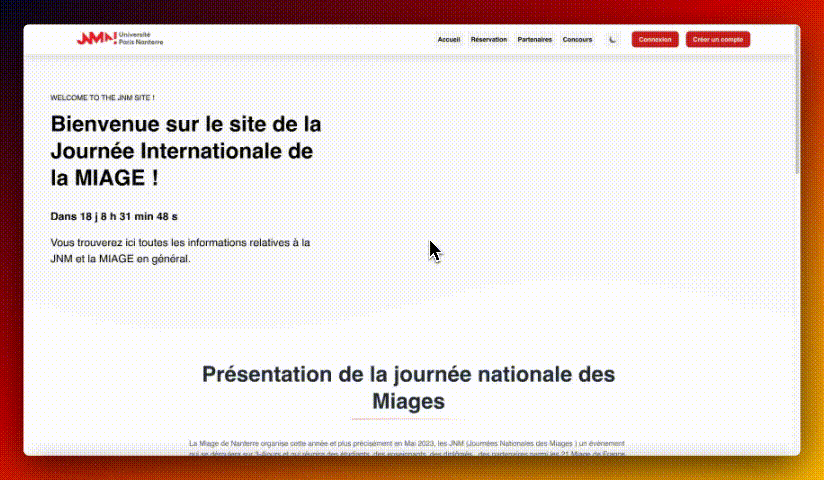

<p align="center">
    <a>
        
    </a>
</p>

<h1 align="center">JNM <a href="https://laravel.com/">Laravel</a></h1>
<h3 align="center"><i>(Journée Nationales des Miages | Miage National day)</i></h3>

<p align="center">

</p>

<p align="center">
  <p align="center">
      JNM is a web App using Laravel framework and depending on blade template. This App is an event management App for institutional field students and professionals.
</p> 
    <p align="center">
        <a href="https://github.com/hugo-HDSF/JNM_docker_laravel/assets/videos/blob/master/exemple.gif"><strong>View Exemple »</strong></a>
        .
        <a href="https://github.com/hugo-HDSF/JNM_docker_laravel/issues">Report Bug</a>
        .
        
    </p>
</p>

<div align="center">


</div>

<div align="center">


</div>

-----

## Table Of Contents

* [About the Project](#about-the-project)
* [Implementation](#implementation)
* [Built With](#built-with)
* [Getting Started](#getting-started)
    * [Prerequisites](#prerequisites)
    * [Installation](#installation)
* [Containers](#containers)
* [Roadmap](#roadmap)
* [License](#license)
* [Authors](#authors)
* [Acknowledgements](#acknowledgements)

## About The Project





This App is an event management App for institutional field students and professionals that allows to manage the miage national day event during may 2023 organized by the Nanterre University.

## Implementation

> `🚀 Continuous integration`

## Built With

* [Laravel](https://laravel.com/)
* [Docker](https://www.docker.com/)
* [Composer](https://getcomposer.org/)
* [NPM](https://www.npmjs.com/)
* [Blade](https://laravel.com/docs/8.x/blade)
* [Tailwind CSS](https://tailwindcss.com/)
* [Flowbite](https://flowbite.com/)
* [PostCSS](https://postcss.org/)
* [Vite](https://vitejs.dev/)
* [Animate.css](https://animate.style/)
* [Alpine.js](https://alpinejs.dev/)
* [ApexCharts.js](https://apexcharts.com/)
* [Axios](https://axios-http.com/)
* [MySQL](https://www.mysql.com/)
* [Nginx](https://www.nginx.com/)
* [MailHog](https://github.com/mailhog/MailHog)


## Getting Started

To get a local copy up and running, follow these simple steps:

### Prerequisites

> **Warning** [Docker](https://github.com/docker) and [Docker Compose V2](https://github.com/docker/compose/releases) must be installed on your machine. We recommend using [Docker Desktop](https://www.docker.com/products/docker-desktop) for macOS and Windows or [Colima](https://github.com/abiosoft/colima) for advanced macOS and Linux users.

### Installation

> **Note** Compatible with Windows(WSL2), macOS(M1) and Linux.

#### 1. Clone repository

```Shell
git clone https://github.com/hugo-HDSF/JNM_docker_laravel.git
```

- Navigate into the cloned project directory:

```Shell
cd JNM_docker_laravel
```

---

#### 2. Laravel install

> **Note** Either executes de following commands or use the [Makefile](Makefile) command:

```Shell
docker compose build
docker compose up -d
docker compose exec app composer install
docker compose exec app php artisan migrate:refresh
docker compose exec app php artisan db:seed
```
### OR

```Shell
make install
```
---

#### 3. Npm setup

- Navigate into the [src](src) project directory:

```bash
cd src
```

- Run the development server:
```bash
npm run dev
```

#### 4. Open your browser and navigate to https://localhost

> **Warning** credentials are necessary to connect.
> > **Note** You can create an account and validate it with the mailhog interface at https://localhost:8025.
> 
> > **Note** You can find credentials profils [here](src/database/seeders/DatabaseSeeder.php?plain=1#L39-41).

### Containers

<details>
<summary>Click here to expand...</summary>

#### app container

- Base image
    - [php](https://hub.docker.com/_/php):8.1-fpm-bullseye
    - [composer](https://hub.docker.com/_/composer):2.2

#### web container

- Base image
    - [nginx](https://hub.docker.com/_/nginx):1.22

#### db container

- Base image
    - [mysql/mysql-server](https://hub.docker.com/r/mysql/mysql-server):8.0

#### mailhog container

- Base image
    - [mailhog/mailhog](https://hub.docker.com/r/mailhog/mailhog)

</details>

## Roadmap

Check list of known [open issues](https://github.com/hugo-HDSF/JNM_docker_laravel/issues).

## License

Distributed under the MIT License.

## Authors

* **DA SILVA Hugo** - *Student - Fullstack Developer* - [Github](https://github.com/hugo-HDSF/)
* **LUCAS Simon** - *Student - Fullstack Developer* - [Github]()
* **THEVAKUMARAN Krishnath** - *Student - Fullstack Developer* - [Github]()

## Acknowledgements

* __Special thanks to [Ucanlab](https://github.com/ucan-lab) for the [docker-laravel](https://github.com/ucan-lab/docker-laravel) template.__
* [Paris Nanterre University](https://www.parisnanterre.fr/)
* [Img Shields](https://shields.io/)
* [Simple Icons](https://simpleicons.org/)
* [Readme Generator](https://readme.shaankhan.dev/)

###### _Study Project | (BACHELOR) 2022-2023_
